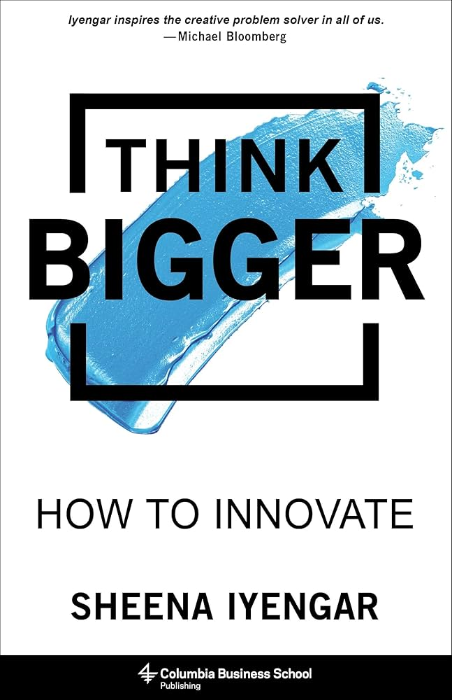

# balance-sheet
The Idea Balance Sheet is a tool that helps you understand the greatness behind ideas, using a scientifically sound, math-based, yet sensitive approach based on the book "Think Bigger - How to innovate" by Sheena Iyengar.

